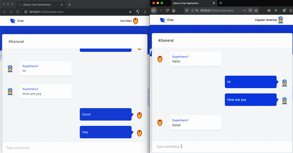

# Add push notifications to your jQuery chat app

Read the full tutorial here:

>> Not yet published

This application detailed the step by step guide on how to add push notifications to a modern group chat application built with jQuery and CometChat.

Take a look at the image below:




## Technology

This demo uses:
* [CometChat](https://cometchat.com/)
* [jQuery](https://jquery.com/)
* [Firebase Cloud Messaging](https://firebase.google.com/)


## Running the demo
To run the demo follow these steps:

1. Head to the [CometChat dashboard](https://app.cometchat.com/) (you'll need to create a free account if you haven't already)
2. From the dashboard, create a new app called "jquery-push-app"
3. Once created, click the button **Explore**
4. Click **API Keys** on the left-hand-side and note the automatically-generated Full access API Key and the application ID as well
5. Go to the **Groups** tab and note the GUID of the group automatically created by CometChat
6. Enable Push notification extension from the `Extensions menu`
7. Download the repository [here](https://github.com/yemiwebby/jquery-push-notification/archive/master.zip) or by running `git clone https://github.com/yemiwebby/jquery-push-notification.git`

8. Register a Firebase account [here](http://firebase.google.com/) and create a new Firebase project.
9. Add a new web application into your Firebase project
10. Click on the settings menu, then go to the general tab
11. Copy the Firebase config variable similar to this:
```
var firebaseConfig = {
  apiKey: "YOUR_FIREBASE_API_KEY",
  authDomain: "AUTH_DOMAIN",
  databaseURL: "DATABASE_URL",
  projectId: "PROJECT_ID",
  storageBucket: "",
  messagingSenderId: "MESSAGING_SENDER_ID",
  appId: "YOUR_APP_ID"
};
```
and paste it in `js/pushNotification.js`. 

Also, paste only the `messagingSenderId` in `./firebase-messaging-sw.js`. Ensure to replace the `MESSAGING_SENDER_ID` placeholder with the appropriate credential.

Next, open `js/scripts.js` and replace the placeholder below with your credentials as obtained from your CometChat dashboard:

```
window.COMETCHAT_APP_ID = 'YOUR_COMMETCHAT_APP_ID';
window.COMETCHAT_API_KEY = 'YOUR_COMMETCHAT_API_KEY';
```

12. In Firebase settings, click on `Cloud Messaging`tab and copy the server key there.
13. Go back into CometChat PRO dashboard and select the `Extensions` tab from the sidebar and then click on `Actions -> Settings`. Give your notification a title and paste the server key in there.

14. Open the `index.html` file from any of your favorite browser to view the application.

15. Open the application in two separate windows and log in with any two of the test users: superhero1, superhero2, or superhero3

16. Once you are able to log in from both window, type a message and hit `Enter` on your keyboard to start a chat

The push notification will be displayed at the top right corner of your window browser.


## Useful links
* 🏠 [CometChat Homepage](https://www.cometchat.com/pro)
* 🚀 [Create your free account](https://app.cometchat.com/#/apps)
* 📚 [Documentation](https://prodocs.cometchat.com/docs)
* 👾 [GitHub](https://github.com/CometChat-Pro)